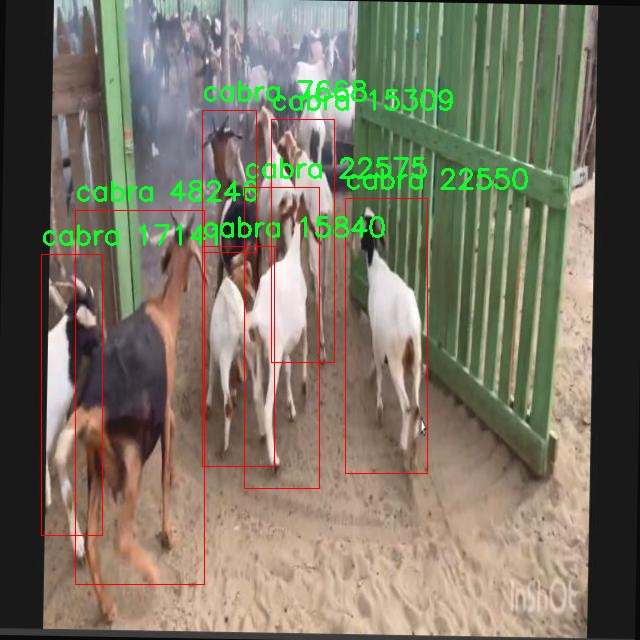

# 山羊检测系统源码分享
 # [一条龙教学YOLOV8标注好的数据集一键训练_70+全套改进创新点发刊_Web前端展示]

### 1.研究背景与意义

项目参考[AAAI Association for the Advancement of Artificial Intelligence](https://gitee.com/qunmasj/projects)

项目来源[AACV Association for the Advancement of Computer Vision](https://kdocs.cn/l/cszuIiCKVNis)

研究背景与意义

随着农业现代化的不断推进，山羊养殖作为一种重要的畜牧业形式，受到了越来越多的关注。山羊不仅为人类提供了丰富的肉类、奶制品和皮革等资源，同时在生态保护和草地管理中也发挥着重要作用。然而，传统的山羊管理方式往往依赖人工巡查，效率低下且容易受到人为因素的影响。因此，开发一种高效、准确的山羊检测系统显得尤为重要。

近年来，计算机视觉技术的迅猛发展为动物检测和识别提供了新的解决方案。YOLO（You Only Look Once）系列模型因其高效的实时检测能力和较高的准确率，成为了目标检测领域的研究热点。YOLOv8作为该系列的最新版本，进一步提升了检测精度和速度，尤其在复杂环境下的表现更为突出。然而，现有的YOLOv8模型在特定领域的应用上仍存在一定的局限性，尤其是在特定动物种类的检测上。因此，基于改进YOLOv8的山羊检测系统的研究具有重要的理论和实践意义。

本研究将以“Cabras”数据集为基础，进行山羊检测系统的构建。该数据集包含3000张图像，涵盖了两类目标，主要集中在山羊的检测与识别上。通过对这一数据集的深入分析与处理，研究者可以提取出山羊在不同环境下的特征信息，从而为后续的模型训练提供丰富的数据支持。数据集的多样性和丰富性为模型的泛化能力提升奠定了基础，能够有效提高检测系统在实际应用中的表现。

在技术层面，本研究将针对YOLOv8模型进行一系列改进，以适应山羊检测的特定需求。这些改进可能包括优化网络结构、调整损失函数、增强数据预处理等。通过这些措施，期望能够提升模型在复杂背景下的检测精度，减少误检和漏检的情况。同时，研究还将探索如何利用迁移学习等技术，借助已有的预训练模型，加速模型的收敛速度，提高训练效率。

此外，山羊检测系统的开发不仅具有学术价值，也具备广泛的应用前景。通过实现高效的山羊检测，养殖户可以实时监控山羊的活动状态，及时发现异常情况，从而提高养殖管理的科学性和有效性。同时，该系统还可以为生态保护、草地管理等领域提供数据支持，助力可持续发展。

综上所述，基于改进YOLOv8的山羊检测系统的研究，不仅能够推动计算机视觉技术在农业领域的应用，还将为山羊养殖管理提供新的解决方案，具有重要的研究背景与实际意义。通过这一研究，期望能够为未来的智能农业发展提供理论基础和技术支持。

### 2.图片演示


##### 注意：由于此博客编辑较早，上面“2.图片演示”和“3.视频演示”展示的系统图片或者视频可能为老版本，新版本在老版本的基础上升级如下：（实际效果以升级的新版本为准）

  （1）适配了YOLOV8的“目标检测”模型和“实例分割”模型，通过加载相应的权重（.pt）文件即可自适应加载模型。

  （2）支持“图片识别”、“视频识别”、“摄像头实时识别”三种识别模式。

  （3）支持“图片识别”、“视频识别”、“摄像头实时识别”三种识别结果保存导出，解决手动导出（容易卡顿出现爆内存）存在的问题，识别完自动保存结果并导出到tempDir中。

  （4）支持Web前端系统中的标题、背景图等自定义修改，后面提供修改教程。

  另外本项目提供训练的数据集和训练教程,暂不提供权重文件（best.pt）,需要您按照教程进行训练后实现图片演示和Web前端界面演示的效果。

### 3.视频演示

[3.1 视频演示](https://www.bilibili.com/video/BV1Ww2EY7Ekf/)

### 4.数据集信息展示

##### 4.1 本项目数据集详细数据（类别数＆类别名）

nc: 2
names: ['cabra', 'dw']


##### 4.2 本项目数据集信息介绍

数据集信息展示

在本研究中，我们采用了名为“Cabras”的数据集，以改进YOLOv8的山羊检测系统。该数据集专门针对山羊（cabra）及其相关类别（dw）进行了精心构建，旨在提升计算机视觉算法在农业和动物监测领域的应用效果。数据集的类别数量为2，具体包括“cabra”和“dw”，这两个类别的选择反映了我们对山羊检测任务的关注和需求。

“Cabras”数据集的构建过程充分考虑了山羊在自然环境中的多样性和复杂性。数据集中包含了大量的图像样本，这些样本来源于不同的地理位置和气候条件，确保了数据的多样性和代表性。每一张图像都经过精确标注，标注信息涵盖了山羊的不同姿态、角度以及在各种背景下的表现。这种细致的标注不仅为YOLOv8模型的训练提供了丰富的样本，也为后续的模型评估和性能优化奠定了基础。

在数据集的构建过程中，我们特别关注了图像的质量和清晰度。所有图像均经过严格筛选，确保其分辨率足够高，以便于模型在特征提取时能够捕捉到细微的差异。此外，数据集中还包含了不同光照条件下的图像，以模拟实际应用场景中可能遇到的各种环境因素。这种多样化的图像来源和条件设置，使得“Cabras”数据集在训练过程中能够有效提升YOLOv8模型的鲁棒性和泛化能力。

为了进一步增强数据集的实用性，我们还考虑了数据增强技术的应用。通过对原始图像进行旋转、缩放、裁剪和颜色调整等处理，生成了更多的训练样本。这种数据增强策略不仅增加了数据集的规模，还有效地提升了模型对不同场景和条件的适应能力。经过这些处理后，数据集的有效样本数量大幅增加，为YOLOv8模型的训练提供了更为丰富的输入。

在进行模型训练时，我们将“Cabras”数据集分为训练集和验证集，以便于对模型的性能进行全面评估。训练集用于模型的学习和参数调整，而验证集则用于监测模型在未见数据上的表现。这种分割策略确保了模型的训练过程不会过拟合，从而提高了其在实际应用中的有效性和可靠性。

总之，“Cabras”数据集为改进YOLOv8的山羊检测系统提供了坚实的基础。通过精心设计的类别结构、丰富的样本多样性以及有效的数据增强策略，该数据集不仅提升了模型的训练效果，也为未来在农业监测、生态研究等领域的应用奠定了良好的基础。随着研究的深入，我们期待“Cabras”数据集能够为山羊检测技术的发展贡献更多的力量。




### 5.全套项目环境部署视频教程（零基础手把手教学）

[5.1 环境部署教程链接（零基础手把手教学）](https://www.ixigua.com/7404473917358506534?logTag=c807d0cbc21c0ef59de5)


[5.2 安装Python虚拟环境创建和依赖库安装视频教程链接（零基础手把手教学）](https://www.ixigua.com/7404474678003106304?logTag=1f1041108cd1f708b01a)

### 6.手把手YOLOV8训练视频教程（零基础小白有手就能学会）

[6.1 手把手YOLOV8训练视频教程（零基础小白有手就能学会）](https://www.ixigua.com/7404477157818401292?logTag=d31a2dfd1983c9668658)


按照上面的训练视频教程链接加载项目提供的数据集，运行train.py即可开始训练



     Epoch   gpu_mem       box       obj       cls    labels  img_size
     1/200     20.8G   0.01576   0.01955  0.007536        22      1280: 100%|██████████| 849/849 [14:42<00:00,  1.04s/it]
               Class     Images     Labels          P          R     mAP@.5 mAP@.5:.95: 100%|██████████| 213/213 [01:14<00:00,  2.87it/s]
                 all       3395      17314      0.994      0.957      0.0957      0.0843

     Epoch   gpu_mem       box       obj       cls    labels  img_size
     2/200     20.8G   0.01578   0.01923  0.007006        22      1280: 100%|██████████| 849/849 [14:44<00:00,  1.04s/it]
               Class     Images     Labels          P          R     mAP@.5 mAP@.5:.95: 100%|██████████| 213/213 [01:12<00:00,  2.95it/s]
                 all       3395      17314      0.996      0.956      0.0957      0.0845

     Epoch   gpu_mem       box       obj       cls    labels  img_size
     3/200     20.8G   0.01561    0.0191  0.006895        27      1280: 100%|██████████| 849/849 [10:56<00:00,  1.29it/s]
               Class     Images     Labels          P          R     mAP@.5 mAP@.5:.95: 100%|███████   | 187/213 [00:52<00:00,  4.04it/s]
                 all       3395      17314      0.996      0.957      0.0957      0.0845


### 7.70+种全套YOLOV8创新点代码加载调参视频教程（一键加载写好的改进模型的配置文件）

[7.1 70+种全套YOLOV8创新点代码加载调参视频教程（一键加载写好的改进模型的配置文件）](https://www.ixigua.com/7404478314661806627?logTag=29066f8288e3f4eea3a4)

### 8.70+种全套YOLOV8创新点原理讲解（非科班也可以轻松写刊发刊，V10版本正在科研待更新）

#### 由于篇幅限制，每个创新点的具体原理讲解就不一一展开，具体见下列网址中的创新点对应子项目的技术原理博客网址【Blog】：


[8.1 70+种全套YOLOV8创新点原理讲解链接](https://gitee.com/qunmasj/good)

#### 部分改进原理讲解(完整的改进原理见上图和技术博客链接)
### YOLOv8简介
#### Backbone


借鉴了其他算法的这些设计思想

借鉴了VGG的思想，使用了较多的3×3卷积，在每一次池化操作后，将通道数翻倍；

借鉴了network in network的思想，使用全局平均池化（global average pooling）做预测，并把1×1的卷积核置于3×3的卷积核之间，用来压缩特征；（我没找到这一步体现在哪里）

使用了批归一化层稳定模型训练，加速收敛，并且起到正则化作用。

    以上三点为Darknet19借鉴其他模型的点。Darknet53当然是在继承了Darknet19的这些优点的基础上再新增了下面这些优点的。因此列在了这里

借鉴了ResNet的思想，在网络中大量使用了残差连接，因此网络结构可以设计的很深，并且缓解了训练中梯度消失的问题，使得模型更容易收敛。

使用步长为2的卷积层代替池化层实现降采样。（这一点在经典的Darknet-53上是很明显的，output的长和宽从256降到128，再降低到64，一路降低到8，应该是通过步长为2的卷积层实现的；在YOLOv8的卷积层中也有体现，比如图中我标出的这些位置）

#### 特征融合

模型架构图如下

  Darknet-53的特点可以这样概括：（Conv卷积模块+Residual Block残差块）串行叠加4次

  Conv卷积层+Residual Block残差网络就被称为一个stage


上面红色指出的那个，原始的Darknet-53里面有一层 卷积，在YOLOv8里面，把一层卷积移除了

为什么移除呢？

        原始Darknet-53模型中间加的这个卷积层做了什么？滤波器（卷积核）的个数从 上一个卷积层的512个，先增加到1024个卷积核，然后下一层卷积的卷积核的个数又降低到512个

        移除掉这一层以后，少了1024个卷积核，就可以少做1024次卷积运算，同时也少了1024个3×3的卷积核的参数，也就是少了9×1024个参数需要拟合。这样可以大大减少了模型的参数，（相当于做了轻量化吧）

        移除掉这个卷积层，可能是因为作者发现移除掉这个卷积层以后，模型的score有所提升，所以才移除掉的。为什么移除掉以后，分数有所提高呢？可能是因为多了这些参数就容易，参数过多导致模型在训练集删过拟合，但是在测试集上表现很差，最终模型的分数比较低。你移除掉这个卷积层以后，参数减少了，过拟合现象不那么严重了，泛化能力增强了。当然这个是，拿着你做实验的结论，反过来再找补，再去强行解释这种现象的合理性。

过拟合


通过MMdetection官方绘制册这个图我们可以看到，进来的这张图片经过一个“Feature Pyramid Network(简称FPN)”，然后最后的P3、P4、P5传递给下一层的Neck和Head去做识别任务。 PAN（Path Aggregation Network）


“FPN是自顶向下，将高层的强语义特征传递下来。PAN就是在FPN的后面添加一个自底向上的金字塔，对FPN补充，将低层的强定位特征传递上去，

FPN是自顶（小尺寸，卷积次数多得到的结果，语义信息丰富）向下（大尺寸，卷积次数少得到的结果），将高层的强语义特征传递下来，对整个金字塔进行增强，不过只增强了语义信息，对定位信息没有传递。PAN就是针对这一点，在FPN的后面添加一个自底（卷积次数少，大尺寸）向上（卷积次数多，小尺寸，语义信息丰富）的金字塔，对FPN补充，将低层的强定位特征传递上去，又被称之为“双塔战术”。

FPN层自顶向下传达强语义特征，而特征金字塔则自底向上传达强定位特征，两两联手，从不同的主干层对不同的检测层进行参数聚合,这样的操作确实很皮。
#### 自底向上增强

而 PAN（Path Aggregation Network）是对 FPN 的一种改进，它的设计理念是在 FPN 后面添加一个自底向上的金字塔。PAN 引入了路径聚合的方式，通过将浅层特征图（低分辨率但语义信息较弱）和深层特征图（高分辨率但语义信息丰富）进行聚合，并沿着特定的路径传递特征信息，将低层的强定位特征传递上去。这样的操作能够进一步增强多尺度特征的表达能力，使得 PAN 在目标检测任务中表现更加优秀。


### 可重参化EfficientRepBiPAN优化Neck
#### Repvgg-style
Repvgg-style的卷积层包含
卷积+ReLU结构，该结构能够有效地利用硬件资源。

在训练时，Repvgg-style的卷积层包含
卷积、
卷积、identity。（下图左图）


在推理时，通过重参数化（re-parameterization），上述的多分支结构可以转换为单分支的
卷积。（下图右图）


基于上述思想，作者设计了对GPU硬件友好的EfficientRep Backbone和Rep-PAN Neck，将它们用于YOLOv6中。

EfficientRep Backbone的结构图：


Rep-PAN Neck结构图：


#### Multi-path
只使用repvgg-style不能达到很好的精度-速度平衡，对于大模型，作者探索了多路径的网络结构。

参考该博客提出了Bep unit，其结构如下图所示：


CSP（Cross Stage Partial）-style计算量小，且有丰富的梯度融合信息，广泛应用于YOLO系列中，比如YOLOv5、PPYOLOE。

作者将Bep unit与CSP-style结合，设计了一种新的网络结构BepC3，如下图所示：


基于BepC3模块，作者设计了新的CSPBep Backbone和CSPRepPAN Neck，以达到很好的精度-速度平衡。

其他YOLO系列在使用CSP-stype结构时，partial ratio设置为1/2。为了达到更好的性能，在YOLOv6m中partial ratio的值为2/3，在YOLOv6l中partial ratio的值为1/2。

对于YOLOv6m，单纯使用Rep-style结构和使用BepC3结构的对比如下图所示：

#### BIFPN
BiFPN 全称 Bidirectional Feature Pyramid Network 加权双向（自顶向下 + 自低向上）特征金字塔网络。

相比较于PANet，BiFPN在设计上的改变：

总结下图：
图d 蓝色部分为自顶向下的通路，传递的是高层特征的语义信息；红色部分是自底向上的通路，传递的是低层特征的位置信息；紫色部分是上述第二点提到的同一层在输入节点和输入节点间新加的一条边。


我们删除那些只有一条输入边的节点。这么做的思路很简单：如果一个节点只有一条输入边而没有特征融合，那么它对旨在融合不同特征的特征网络的贡献就会很小。删除它对我们的网络影响不大，同时简化了双向网络；如上图d 的 P7右边第一个节点

如果原始输入节点和输出节点处于同一层，我们会在原始输入节点和输出节点之间添加一条额外的边。思路：以在不增加太多成本的情况下融合更多的特性；

与只有一个自顶向下和一个自底向上路径的PANet不同，我们处理每个双向路径(自顶向下和自底而上)路径作为一个特征网络层，并重复同一层多次，以实现更高层次的特征融合。如下图EfficientNet 的网络结构所示，我们对BiFPN是重复使用多次的。而这个使用次数也不是我们认为设定的，而是作为参数一起加入网络的设计当中，使用NAS技术算出来的。


Weighted Feature Fusion 带权特征融合：学习不同输入特征的重要性，对不同输入特征有区分的融合。
设计思路：传统的特征融合往往只是简单的 feature map 叠加/相加 (sum them up)，比如使用concat或者shortcut连接，而不对同时加进来的 feature map 进行区分。然而，不同的输入 feature map 具有不同的分辨率，它们对融合输入 feature map 的贡献也是不同的，因此简单的对他们进行相加或叠加处理并不是最佳的操作。所以这里我们提出了一种简单而高效的加权特融合的机制。
常见的带权特征融合有三种方法，分别是：


​
  这种方法比较简单，直接加一个可学习的权重。但是由于这个权重不受限制，所有可能引起训练的不稳定，所有并不推荐。
Softmax-based fusion: O = ∑ i e w i ∗ I i ϵ + ∑ j e w j O = \sum_{i} \frac{e^{w_i} * I_i}{ \epsilon+\sum_{j}e^{w_j}}O=∑ 

 

​
  使用这种方法可以将范围放缩到 [ 0 , 1 ] [0, 1][0,1] 之间，训练稳定，但是训练很慢，所有也不推荐。
Fast normalized fusion: O = ∑ i w i ∗ I i ϵ + ∑ j w j O = \sum_{i} \frac{w_i * I_i}{ \epsilon+\sum_{j}w_j}O=∑ 


### 9.系统功能展示（检测对象为举例，实际内容以本项目数据集为准）

图9.1.系统支持检测结果表格显示

  图9.2.系统支持置信度和IOU阈值手动调节

  图9.3.系统支持自定义加载权重文件best.pt(需要你通过步骤5中训练获得)

  图9.4.系统支持摄像头实时识别

  图9.5.系统支持图片识别

  图9.6.系统支持视频识别

  图9.7.系统支持识别结果文件自动保存

  图9.8.系统支持Excel导出检测结果数据


### 10.原始YOLOV8算法原理

原始YOLOv8算法原理

YOLOv8作为YOLO系列的最新迭代，继承并发展了其前辈的核心思想，将目标检测任务转化为一个回归问题，通过一个单一的神经网络模型同时预测目标的位置和类别。相较于以往的版本，YOLOv8在网络结构、训练策略和检测精度等多个方面进行了显著的优化，尤其是在轻量化设计和实时检测能力上，展现出了卓越的性能。

YOLOv8的网络结构主要由三部分组成：主干网络（Backbone）、特征增强网络（Neck）和检测头（Head）。在主干网络中，YOLOv8继续采用CSP（Cross Stage Partial）网络的设计理念，以提高特征提取的效率和准确性。与之前的YOLO版本相比，YOLOv8在主干网络中引入了C2F模块，这一模块通过更轻量化的设计，替代了传统的C3模块，显著降低了计算复杂度。C2F模块的设计不仅优化了卷积操作，将卷积核的大小调整为3×3，同时在深度上进行了合理的配置，使得网络在保持较高特征提取能力的同时，具备了更快的推理速度。

在特征增强网络方面，YOLOv8采用了PAN-FPN（Path Aggregation Network - Feature Pyramid Network）的结构，这一结构通过有效的特征融合，提升了模型对不同尺度特征信息的提取能力。特征融合网络中引入的BiFPN（Bidirectional Feature Pyramid Network）进一步优化了特征的跨尺度连接与加权融合，使得YOLOv8能够在多尺度目标检测中表现得更加出色。BiFPN的设计理念在于通过高效的双向连接，提升特征信息的流动性，从而加速模型对不同尺度目标的响应。

在检测头部分，YOLOv8采用了解耦合头结构，将分类和回归任务分离开来。传统的YOLO版本通常将这两个任务耦合在一起，导致在复杂场景下可能出现定位不准或分类错误的问题。而通过解耦，YOLOv8使得每个任务可以更加专注于自身的目标，从而提高了整体的检测精度。此外，YOLOv8还引入了Anchor-free的目标检测方法，摒弃了传统的锚框设计，直接通过回归方式预测目标的位置和大小。这一创新使得模型能够更快地聚焦于目标位置的邻近点，提升了预测框与实际边界框的重合度，尤其在处理不同尺度和形状的目标时，表现得更加灵活。

在训练过程中，YOLOv8采用了一系列先进的数据增强策略，以提高模型的泛化能力。例如，在训练的最后10个epoch中，YOLOv8关闭了马赛克增强，这一策略旨在减少训练过程中可能引入的噪声，从而使模型能够更好地学习到目标的特征。此外，YOLOv8还使用了动态的Task-Aligned Assigner样本分配策略，以优化训练过程中的样本选择，确保模型在训练时能够接触到多样化的目标样本，提高了模型的鲁棒性。

在损失函数的设计上，YOLOv8同样进行了创新。它采用了BCELoss作为分类损失，DFLLoss与CIoULoss作为回归损失，这种多损失函数的组合能够更好地平衡分类与回归任务的训练，确保模型在精度和速度之间达到最佳的平衡。

总体而言，YOLOv8在轻量化设计、特征提取、任务解耦及损失计算等多个方面的创新，使其在目标检测领域中展现出了优异的性能。无论是在实时检测的需求下，还是在资源受限的嵌入式设备上，YOLOv8都能够提供快速且高效的目标检测解决方案。这些创新不仅推动了YOLO系列的发展，也为目标检测技术的进一步应用奠定了坚实的基础。随着YOLOv8的推广与应用，未来的目标检测任务将会更加高效、准确，为各类智能应用提供强有力的支持。


### 11.项目核心源码讲解（再也不用担心看不懂代码逻辑）

#### 11.1 code\ultralytics\utils\callbacks\wb.py

以下是经过精简和注释的核心代码部分，主要集中在与WandB（Weights and Biases）集成的功能上，包括绘制精确度-召回率曲线和记录训练过程中的指标。

```python
# 导入必要的库
from ultralytics.utils import SETTINGS, TESTS_RUNNING
from ultralytics.utils.torch_utils import model_info_for_loggers
import numpy as np
import pandas as pd

# 尝试导入WandB库并进行一些基本的检查
try:
    assert not TESTS_RUNNING  # 确保不是在测试中
    assert SETTINGS["wandb"] is True  # 确保WandB集成已启用
    import wandb as wb
    assert hasattr(wb, "__version__")  # 确保WandB包已正确导入
    _processed_plots = {}  # 用于跟踪已处理的图表
except (ImportError, AssertionError):
    wb = None  # 如果导入失败，则将wb设置为None

def _custom_table(x, y, classes, title="Precision Recall Curve", x_title="Recall", y_title="Precision"):
    """
    创建并记录自定义的精确度-召回率曲线可视化。
    """
    # 创建数据框
    df = pd.DataFrame({"class": classes, "y": y, "x": x}).round(3)
    fields = {"x": "x", "y": "y", "class": "class"}
    string_fields = {"title": title, "x-axis-title": x_title, "y-axis-title": y_title}
    
    # 返回WandB的表格对象
    return wb.plot_table(
        "wandb/area-under-curve/v0", wb.Table(dataframe=df), fields=fields, string_fields=string_fields
    )

def _plot_curve(x, y, names=None, id="precision-recall", title="Precision Recall Curve", x_title="Recall", y_title="Precision", num_x=100, only_mean=False):
    """
    记录一个指标曲线的可视化。
    """
    if names is None:
        names = []
    x_new = np.linspace(x[0], x[-1], num_x).round(5)  # 创建新的x值

    # 记录数据
    x_log = x_new.tolist()
    y_log = np.interp(x_new, x, np.mean(y, axis=0)).round(3).tolist()  # 计算y的均值

    if only_mean:
        # 仅记录均值曲线
        table = wb.Table(data=list(zip(x_log, y_log)), columns=[x_title, y_title])
        wb.run.log({title: wb.plot.line(table, x_title, y_title, title=title)})
    else:
        # 记录每个类的曲线
        classes = ["mean"] * len(x_log)
        for i, yi in enumerate(y):
            x_log.extend(x_new)  # 添加新的x值
            y_log.extend(np.interp(x_new, x, yi))  # 插值y到新的x
            classes.extend([names[i]] * len(x_new))  # 添加类名
        wb.log({id: _custom_table(x_log, y_log, classes, title, x_title, y_title)}, commit=False)

def on_fit_epoch_end(trainer):
    """在每个训练周期结束时记录训练指标和模型信息。"""
    wb.run.log(trainer.metrics, step=trainer.epoch + 1)  # 记录当前周期的指标
    # 记录图表
    _log_plots(trainer.plots, step=trainer.epoch + 1)
    _log_plots(trainer.validator.plots, step=trainer.epoch + 1)
    if trainer.epoch == 0:
        wb.run.log(model_info_for_loggers(trainer), step=trainer.epoch + 1)  # 记录模型信息

def on_train_end(trainer):
    """在训练结束时保存最佳模型作为工件。"""
    _log_plots(trainer.validator.plots, step=trainer.epoch + 1)
    _log_plots(trainer.plots, step=trainer.epoch + 1)
    art = wb.Artifact(type="model", name=f"run_{wb.run.id}_model")  # 创建模型工件
    if trainer.best.exists():
        art.add_file(trainer.best)  # 添加最佳模型文件
        wb.run.log_artifact(art, aliases=["best"])  # 记录工件
    wb.run.finish()  # 结束WandB运行

# 定义回调函数
callbacks = {
    "on_fit_epoch_end": on_fit_epoch_end,
    "on_train_end": on_train_end,
} if wb else {}
```

### 代码说明：
1. **导入库**：导入必要的库和模块，包括WandB和数据处理库。
2. **WandB初始化**：检查WandB是否正确导入，并确保集成已启用。
3. **自定义表格函数**：`_custom_table`函数用于创建和记录精确度-召回率曲线的可视化。
4. **绘制曲线函数**：`_plot_curve`函数根据输入数据生成并记录指标曲线的可视化。
5. **训练结束回调**：`on_fit_epoch_end`和`on_train_end`函数在训练过程中的不同阶段记录指标和模型信息。

通过这些核心功能，代码能够有效地记录和可视化模型训练过程中的重要指标，帮助开发者监控模型性能。

这个文件 `wb.py` 是一个用于与 Weights & Biases（wandb）集成的回调模块，主要用于记录和可视化深度学习模型训练过程中的各种指标和图表。文件首先导入了一些必要的库，并检查 wandb 是否可用以及设置是否启用。接下来，定义了一些函数来处理不同的可视化和日志记录任务。

在导入部分，文件首先确保在运行测试时不会记录任何日志，并检查设置中是否启用了 wandb。若条件不满足，则将 `wb` 设置为 `None`，以避免后续代码出错。

接下来的 `_custom_table` 函数用于创建并记录一个自定义的精确度-召回曲线图。它接受 x 和 y 轴的数据、类别标签以及图表的标题和轴标签作为参数。函数内部使用 Pandas 创建一个数据框，并利用 wandb 的 `plot_table` 方法生成一个可记录的对象。

`_plot_curve` 函数则用于生成并记录一个指标曲线的可视化。它根据输入的数据生成曲线，可以选择仅记录平均曲线或每个类别的曲线。该函数使用插值方法生成新的 x 值，并根据这些值计算对应的 y 值，然后调用 `_custom_table` 函数进行记录。

`_log_plots` 函数用于记录输入字典中的图表，确保在指定的步骤中不会重复记录相同的图表。

文件中还定义了一些回调函数，这些函数在训练的不同阶段被调用。`on_pretrain_routine_start` 函数在预训练开始时初始化 wandb 项目。`on_fit_epoch_end` 函数在每个训练周期结束时记录训练指标和模型信息。`on_train_epoch_end` 函数在每个训练周期结束时记录标签损失和学习率，并在第一次周期结束时记录图表。`on_train_end` 函数在训练结束时保存最佳模型，并记录验证器的图表和曲线。

最后，文件定义了一个 `callbacks` 字典，其中包含了所有的回调函数，如果 wandb 可用，则将这些函数作为回调进行使用。这个模块的主要目的是为了便于在训练过程中监控和记录模型的性能，帮助开发者更好地理解和优化模型。

#### 11.2 ui.py

以下是保留的核心代码部分，并附上详细的中文注释：

```python
import sys
import subprocess

def run_script(script_path):
    """
    使用当前 Python 环境运行指定的脚本。

    Args:
        script_path (str): 要运行的脚本路径

    Returns:
        None
    """
    # 获取当前 Python 解释器的路径
    python_path = sys.executable

    # 构建运行命令，使用 streamlit 运行指定的脚本
    command = f'"{python_path}" -m streamlit run "{script_path}"'

    # 执行命令，并等待其完成
    result = subprocess.run(command, shell=True)
    
    # 检查命令执行结果，如果返回码不为0，表示执行出错
    if result.returncode != 0:
        print("脚本运行出错。")

# 主程序入口
if __name__ == "__main__":
    # 指定要运行的脚本路径
    script_path = "web.py"  # 假设脚本在当前目录下

    # 调用函数运行指定的脚本
    run_script(script_path)
```

### 代码注释说明：
1. **导入模块**：
   - `sys`：用于获取当前 Python 解释器的路径。
   - `subprocess`：用于执行外部命令。

2. **定义 `run_script` 函数**：
   - 该函数接收一个脚本路径作为参数，并在当前 Python 环境中运行该脚本。
   - 使用 `sys.executable` 获取当前 Python 解释器的路径。
   - 构建命令字符串，使用 `streamlit` 模块运行指定的脚本。
   - 使用 `subprocess.run` 执行命令，并等待其完成。
   - 检查命令的返回码，如果不为0，表示脚本运行出错，并打印错误信息。

3. **主程序入口**：
   - 当脚本作为主程序运行时，指定要运行的脚本路径（假设为 `web.py`）。
   - 调用 `run_script` 函数来执行该脚本。

这个程序文件名为 `ui.py`，其主要功能是使用当前的 Python 环境来运行一个指定的脚本。代码首先导入了必要的模块，包括 `sys`、`os` 和 `subprocess`，以及一个自定义的 `abs_path` 函数，用于获取文件的绝对路径。

在 `run_script` 函数中，程序接受一个参数 `script_path`，这是要运行的脚本的路径。函数首先获取当前 Python 解释器的路径，并使用这个路径构建一个命令，该命令用于通过 `streamlit` 模块运行指定的脚本。`subprocess.run` 被用来执行这个命令，`shell=True` 允许在 shell 中执行命令。

如果脚本运行过程中出现错误，返回码不为零，程序会打印出“脚本运行出错”的提示信息。

在文件的最后部分，使用 `if __name__ == "__main__":` 语句来确保只有在直接运行该文件时才会执行后面的代码。这里指定了要运行的脚本路径为 `web.py`，并调用 `run_script` 函数来执行这个脚本。

整体来看，这个程序的设计目的是为了方便地运行一个名为 `web.py` 的脚本，且能够处理运行中的错误。

#### 11.3 70+种YOLOv8算法改进源码大全和调试加载训练教程（非必要）\ultralytics\nn\extra_modules\RFAConv.py

以下是保留的核心代码部分，并附上详细的中文注释：

```python
import torch
import torch.nn as nn
from einops import rearrange

class h_swish(nn.Module):
    """实现h-swish激活函数"""
    def __init__(self, inplace=True):
        super(h_swish, self).__init__()
        self.sigmoid = h_sigmoid(inplace=inplace)

    def forward(self, x):
        return x * self.sigmoid(x)

class RFAConv(nn.Module):
    """RFAConv模块，结合了特征生成和加权机制"""
    def __init__(self, in_channel, out_channel, kernel_size, stride=1):
        super().__init__()
        self.kernel_size = kernel_size

        # 特征权重生成网络
        self.get_weight = nn.Sequential(
            nn.AvgPool2d(kernel_size=kernel_size, padding=kernel_size // 2, stride=stride),
            nn.Conv2d(in_channel, in_channel * (kernel_size ** 2), kernel_size=1, groups=in_channel, bias=False)
        )
        
        # 特征生成网络
        self.generate_feature = nn.Sequential(
            nn.Conv2d(in_channel, in_channel * (kernel_size ** 2), kernel_size=kernel_size, padding=kernel_size // 2, stride=stride, groups=in_channel, bias=False),
            nn.BatchNorm2d(in_channel * (kernel_size ** 2)),
            nn.ReLU()
        )
        
        # 最终卷积层
        self.conv = nn.Conv2d(in_channel, out_channel, kernel_size=kernel_size, stride=kernel_size)

    def forward(self, x):
        b, c = x.shape[0:2]  # 获取批次大小和通道数
        weight = self.get_weight(x)  # 计算特征权重
        h, w = weight.shape[2:]  # 获取特征图的高和宽
        
        # 计算加权后的特征
        weighted = weight.view(b, c, self.kernel_size ** 2, h, w).softmax(2)  # 归一化权重
        feature = self.generate_feature(x).view(b, c, self.kernel_size ** 2, h, w)  # 生成特征
        weighted_data = feature * weighted  # 加权特征
        
        # 重排特征以适应卷积输入
        conv_data = rearrange(weighted_data, 'b c (n1 n2) h w -> b c (h n1) (w n2)', n1=self.kernel_size, n2=self.kernel_size)
        return self.conv(conv_data)  # 返回卷积结果

class SE(nn.Module):
    """Squeeze-and-Excitation模块"""
    def __init__(self, in_channel, ratio=16):
        super(SE, self).__init__()
        self.gap = nn.AdaptiveAvgPool2d((1, 1))  # 全局平均池化
        self.fc = nn.Sequential(
            nn.Linear(in_channel, ratio, bias=False),  # 从 c -> c/r
            nn.ReLU(),
            nn.Linear(ratio, in_channel, bias=False),  # 从 c/r -> c
            nn.Sigmoid()
        )

    def forward(self, x):
        b, c = x.shape[0:2]  # 获取批次大小和通道数
        y = self.gap(x).view(b, c)  # 进行全局平均池化并展平
        y = self.fc(y).view(b, c, 1, 1)  # 通过全连接层并调整形状
        return y  # 返回通道注意力权重

class RFCBAMConv(nn.Module):
    """RFCBAMConv模块，结合了通道注意力和特征生成"""
    def __init__(self, in_channel, out_channel, kernel_size=3, stride=1):
        super().__init__()
        self.kernel_size = kernel_size
        self.generate = nn.Sequential(
            nn.Conv2d(in_channel, in_channel * (kernel_size ** 2), kernel_size, padding=kernel_size // 2, stride=stride, groups=in_channel, bias=False),
            nn.BatchNorm2d(in_channel * (kernel_size ** 2)),
            nn.ReLU()
        )
        self.get_weight = nn.Sequential(nn.Conv2d(2, 1, kernel_size=3, padding=1, bias=False), nn.Sigmoid())
        self.se = SE(in_channel)  # 引入Squeeze-and-Excitation模块

        self.conv = nn.Conv2d(in_channel, out_channel, kernel_size=kernel_size, stride=kernel_size)

    def forward(self, x):
        b, c = x.shape[0:2]  # 获取批次大小和通道数
        channel_attention = self.se(x)  # 计算通道注意力
        generate_feature = self.generate(x)  # 生成特征

        h, w = generate_feature.shape[2:]  # 获取特征图的高和宽
        generate_feature = generate_feature.view(b, c, self.kernel_size ** 2, h, w)  # 调整形状
        
        # 重排特征以适应卷积输入
        generate_feature = rearrange(generate_feature, 'b c (n1 n2) h w -> b c (h n1) (w n2)', n1=self.kernel_size, n2=self.kernel_size)
        
        # 计算加权特征
        unfold_feature = generate_feature * channel_attention
        max_feature, _ = torch.max(generate_feature, dim=1, keepdim=True)  # 最大特征
        mean_feature = torch.mean(generate_feature, dim=1, keepdim=True)  # 平均特征
        receptive_field_attention = self.get_weight(torch.cat((max_feature, mean_feature), dim=1))  # 计算感受野注意力
        conv_data = unfold_feature * receptive_field_attention  # 加权特征
        return self.conv(conv_data)  # 返回卷积结果
```

### 代码说明：
1. **h_swish**: 实现了h-swish激活函数，结合了ReLU和Sigmoid的特性。
2. **RFAConv**: 通过特征生成和加权机制来增强卷积操作，使用自适应的权重来处理输入特征。
3. **SE**: Squeeze-and-Excitation模块，通过全局平均池化和全连接层来生成通道注意力权重。
4. **RFCBAMConv**: 结合了通道注意力和特征生成的卷积模块，使用最大池化和平均池化来计算感受野注意力，并对特征进行加权。

该程序文件定义了一些改进的卷积模块，主要用于深度学习中的计算机视觉任务，特别是在YOLOv8算法中。文件中包含了几个类，分别是`h_sigmoid`、`h_swish`、`RFAConv`、`RFCBAMConv`和`RFCAConv`，每个类实现了特定的功能。

首先，`h_sigmoid`和`h_swish`是自定义的激活函数，分别实现了带有ReLU6的h-sigmoid和h-swish激活。h-sigmoid通过将输入加3后进行ReLU6处理，再除以6来实现，而h-swish则是将输入与h-sigmoid的输出相乘。

接下来是`RFAConv`类，它实现了一种新的卷积操作。构造函数中定义了多个层，包括一个用于获取权重的平均池化层和卷积层，以及一个用于生成特征的卷积层。`forward`方法中，输入经过权重计算和特征生成后，通过softmax归一化权重，并将特征与权重相乘，最后通过重排操作和卷积层输出结果。

`SE`类实现了Squeeze-and-Excitation（SE）模块，主要用于增强特征通道的表示能力。它通过全局平均池化和两个全连接层来计算通道注意力权重，并将其应用于输入特征。

`RFCBAMConv`类结合了RFAConv和SE模块，增强了特征提取的能力。它在构造函数中定义了生成特征的卷积层、权重获取层和SE模块。在`forward`方法中，首先计算通道注意力，然后生成特征并进行重排，最后通过最大池化和均值池化计算接收场注意力，最终将所有信息结合后通过卷积层输出。

最后，`RFCAConv`类是一个更复杂的卷积模块，结合了RFAConv和通道注意力机制。它在构造函数中定义了生成特征的卷积层、全局池化层和一系列卷积层。在`forward`方法中，生成特征后，分别对高度和宽度进行池化，计算注意力权重，并将其应用于生成的特征，最终通过卷积层输出结果。

整体来看，这些模块通过不同的方式增强了卷积操作的表达能力，能够更好地捕捉特征之间的关系，提升模型的性能。

#### 11.4 70+种YOLOv8算法改进源码大全和调试加载训练教程（非必要）\ultralytics\solutions\__init__.py

以下是保留的核心部分代码，并附上详细的中文注释：

```python
# Ultralytics YOLO 🚀, AGPL-3.0 license

# 导入必要的库
import torch  # 导入PyTorch库，用于深度学习模型的构建和训练

# 定义YOLO模型类
class YOLO:
    def __init__(self, model_path):
        # 初始化YOLO模型
        self.model = torch.load(model_path)  # 加载预训练的YOLO模型

    def predict(self, image):
        # 对输入图像进行预测
        with torch.no_grad():  # 禁用梯度计算以节省内存
            predictions = self.model(image)  # 使用模型对图像进行推理
        return predictions  # 返回预测结果

# 使用示例
if __name__ == "__main__":
    yolo_model = YOLO('yolo_model.pt')  # 创建YOLO模型实例并加载模型权重
    image = torch.randn(1, 3, 640, 640)  # 创建一个随机图像张量作为输入
    results = yolo_model.predict(image)  # 对图像进行预测
    print(results)  # 输出预测结果
```

### 代码注释说明：
1. **导入库**：首先导入了PyTorch库，这是深度学习领域中常用的一个框架，用于构建和训练神经网络模型。
  
2. **YOLO类**：定义了一个YOLO类，包含初始化和预测两个主要功能。
   - `__init__`方法：用于初始化YOLO模型，加载指定路径的预训练模型权重。
   - `predict`方法：接收输入图像，使用模型进行推理，并返回预测结果。使用`torch.no_grad()`可以在推理时禁用梯度计算，以减少内存消耗。

3. **使用示例**：在主程序中，创建YOLO模型实例并加载模型权重，然后生成一个随机图像张量作为输入，最后调用预测方法并输出结果。

这个程序文件的文件名为“70+种YOLOv8算法改进源码大全和调试加载训练教程（非必要）\ultralytics\solutions\__init__.py”，它是一个Python模块的初始化文件，通常用于定义包的结构和导入必要的模块。

文件开头的注释`# Ultralytics YOLO 🚀, AGPL-3.0 license`表明这个代码是与Ultralytics的YOLO（You Only Look Once）系列算法相关的。YOLO是一种流行的目标检测算法，广泛应用于计算机视觉领域。注释中提到的AGPL-3.0许可证是一种开源许可证，允许用户自由使用、修改和分发代码，但要求在分发时也必须开放源代码。

这个`__init__.py`文件的主要作用是将`solutions`目录标识为一个Python包，使得用户可以通过`import`语句导入这个包中的模块。虽然在提供的代码片段中没有其他具体的实现内容，但通常在这个文件中可能会包含一些初始化代码、模块导入或包的元数据。

总的来说，这个文件是YOLOv8算法实现的一部分，旨在为用户提供一个结构化的代码库，以便于进行目标检测任务的研究和开发。

#### 11.5 70+种YOLOv8算法改进源码大全和调试加载训练教程（非必要）\ultralytics\utils\tal.py

以下是代码中最核心的部分，并附上详细的中文注释：

```python
import torch
import torch.nn as nn

def select_candidates_in_gts(xy_centers, gt_bboxes, eps=1e-9):
    """
    选择在真实框(gt)中的正锚点中心。

    参数:
        xy_centers (Tensor): 形状为(h*w, 2)的张量，表示锚点的中心坐标。
        gt_bboxes (Tensor): 形状为(b, n_boxes, 4)的张量，表示真实框的坐标。

    返回:
        (Tensor): 形状为(b, n_boxes, h*w)的张量，表示每个真实框中是否包含锚点中心。
    """
    n_anchors = xy_centers.shape[0]  # 锚点数量
    bs, n_boxes, _ = gt_bboxes.shape  # 批量大小和真实框数量
    lt, rb = gt_bboxes.view(-1, 1, 4).chunk(2, 2)  # 将真实框分为左上角和右下角
    bbox_deltas = torch.cat((xy_centers[None] - lt, rb - xy_centers[None]), dim=2).view(bs, n_boxes, n_anchors, -1)
    return bbox_deltas.amin(3).gt_(eps)  # 返回每个锚点与真实框的最小距离是否大于eps

class TaskAlignedAssigner(nn.Module):
    """
    任务对齐分配器，用于目标检测。

    该类根据任务对齐度量将真实对象分配给锚点，结合了分类和定位信息。

    属性:
        topk (int): 考虑的候选框数量。
        num_classes (int): 目标类别数量。
        alpha (float): 分类组件的alpha参数。
        beta (float): 定位组件的beta参数。
        eps (float): 防止除以零的小值。
    """

    def __init__(self, topk=13, num_classes=80, alpha=1.0, beta=6.0, eps=1e-9):
        """初始化任务对齐分配器对象，设置可调超参数。"""
        super().__init__()
        self.topk = topk
        self.num_classes = num_classes
        self.bg_idx = num_classes  # 背景类别索引
        self.alpha = alpha
        self.beta = beta
        self.eps = eps

    @torch.no_grad()
    def forward(self, pd_scores, pd_bboxes, anc_points, gt_labels, gt_bboxes, mask_gt):
        """
        计算任务对齐分配。

        参数:
            pd_scores (Tensor): 形状为(bs, num_total_anchors, num_classes)的张量，表示锚点的预测分数。
            pd_bboxes (Tensor): 形状为(bs, num_total_anchors, 4)的张量，表示锚点的预测边界框。
            anc_points (Tensor): 形状为(num_total_anchors, 2)的张量，表示锚点的坐标。
            gt_labels (Tensor): 形状为(bs, n_max_boxes, 1)的张量，表示真实框的标签。
            gt_bboxes (Tensor): 形状为(bs, n_max_boxes, 4)的张量，表示真实框的坐标。
            mask_gt (Tensor): 形状为(bs, n_max_boxes, 1)的张量，表示真实框的掩码。

        返回:
            target_labels (Tensor): 形状为(bs, num_total_anchors)的张量，包含正锚点的目标标签。
            target_bboxes (Tensor): 形状为(bs, num_total_anchors, 4)的张量，包含正锚点的目标边界框。
            target_scores (Tensor): 形状为(bs, num_total_anchors, num_classes)的张量，包含正锚点的目标分数。
            fg_mask (Tensor): 形状为(bs, num_total_anchors)的张量，表示正锚点的掩码。
            target_gt_idx (Tensor): 形状为(bs, num_total_anchors)的张量，表示正锚点对应的真实框索引。
        """
        self.bs = pd_scores.size(0)  # 批量大小
        self.n_max_boxes = gt_bboxes.size(1)  # 最大真实框数量

        if self.n_max_boxes == 0:
            device = gt_bboxes.device
            return (torch.full_like(pd_scores[..., 0], self.bg_idx).to(device), 
                    torch.zeros_like(pd_bboxes).to(device),
                    torch.zeros_like(pd_scores).to(device), 
                    torch.zeros_like(pd_scores[..., 0]).to(device),
                    torch.zeros_like(pd_scores[..., 0]).to(device))

        # 获取正锚点掩码和对齐度量
        mask_pos, align_metric, overlaps = self.get_pos_mask(pd_scores, pd_bboxes, gt_labels, gt_bboxes, anc_points, mask_gt)

        # 选择重叠度最高的真实框
        target_gt_idx, fg_mask, mask_pos = select_highest_overlaps(mask_pos, overlaps, self.n_max_boxes)

        # 获取目标标签、边界框和分数
        target_labels, target_bboxes, target_scores = self.get_targets(gt_labels, gt_bboxes, target_gt_idx, fg_mask)

        # 归一化对齐度量
        align_metric *= mask_pos
        pos_align_metrics = align_metric.amax(dim=-1, keepdim=True)  # b, max_num_obj
        pos_overlaps = (overlaps * mask_pos).amax(dim=-1, keepdim=True)  # b, max_num_obj
        norm_align_metric = (align_metric * pos_overlaps / (pos_align_metrics + self.eps)).amax(-2).unsqueeze(-1)
        target_scores = target_scores * norm_align_metric

        return target_labels, target_bboxes, target_scores, fg_mask.bool(), target_gt_idx

    def get_pos_mask(self, pd_scores, pd_bboxes, gt_labels, gt_bboxes, anc_points, mask_gt):
        """获取在真实框中的掩码，形状为(b, max_num_obj, h*w)。"""
        mask_in_gts = select_candidates_in_gts(anc_points, gt_bboxes)  # 获取在真实框中的锚点
        align_metric, overlaps = self.get_box_metrics(pd_scores, pd_bboxes, gt_labels, gt_bboxes, mask_in_gts * mask_gt)  # 计算对齐度量和重叠度
        mask_topk = self.select_topk_candidates(align_metric, topk_mask=mask_gt.expand(-1, -1, self.topk).bool())  # 选择top-k候选
        mask_pos = mask_topk * mask_in_gts * mask_gt  # 合并掩码

        return mask_pos, align_metric, overlaps

    def get_box_metrics(self, pd_scores, pd_bboxes, gt_labels, gt_bboxes, mask_gt):
        """计算给定预测和真实边界框的对齐度量。"""
        na = pd_bboxes.shape[-2]  # 锚点数量
        mask_gt = mask_gt.bool()  # 转换为布尔类型
        overlaps = torch.zeros([self.bs, self.n_max_boxes, na], dtype=pd_bboxes.dtype, device=pd_bboxes.device)  # 初始化重叠度
        bbox_scores = torch.zeros([self.bs, self.n_max_boxes, na], dtype=pd_scores.dtype, device=pd_scores.device)  # 初始化边界框分数

        ind = torch.zeros([2, self.bs, self.n_max_boxes], dtype=torch.long)  # 2, b, max_num_obj
        ind[0] = torch.arange(end=self.bs).view(-1, 1).expand(-1, self.n_max_boxes)  # b, max_num_obj
        ind[1] = gt_labels.squeeze(-1)  # b, max_num_obj
        bbox_scores[mask_gt] = pd_scores[ind[0], :, ind[1]][mask_gt]  # 获取每个锚点的分数

        # 计算重叠度
        pd_boxes = pd_bboxes.unsqueeze(1).expand(-1, self.n_max_boxes, -1, -1)[mask_gt]
        gt_boxes = gt_bboxes.unsqueeze(2).expand(-1, -1, na, -1)[mask_gt]
        overlaps[mask_gt] = bbox_iou(gt_boxes, pd_boxes, xywh=False, CIoU=True).squeeze(-1).clamp_(0)  # 计算IoU

        align_metric = bbox_scores.pow(self.alpha) * overlaps.pow(self.beta)  # 计算对齐度量
        return align_metric, overlaps

    def get_targets(self, gt_labels, gt_bboxes, target_gt_idx, fg_mask):
        """
        计算正锚点的目标标签、目标边界框和目标分数。

        参数:
            gt_labels (Tensor): 真实框标签，形状为(b, max_num_obj, 1)。
            gt_bboxes (Tensor): 真实框边界框，形状为(b, max_num_obj, 4)。
            target_gt_idx (Tensor): 正锚点对应的真实框索引，形状为(b, h*w)。
            fg_mask (Tensor): 布尔张量，形状为(b, h*w)，表示正锚点。

        返回:
            (Tuple[Tensor, Tensor, Tensor]): 包含目标标签、目标边界框和目标分数的元组。
        """
        batch_ind = torch.arange(end=self.bs, dtype=torch.int64, device=gt_labels.device)[..., None]
        target_gt_idx = target_gt_idx + batch_ind * self.n_max_boxes  # 更新索引
        target_labels = gt_labels.long().flatten()[target_gt_idx]  # 获取目标标签

        target_bboxes = gt_bboxes.view(-1, 4)[target_gt_idx]  # 获取目标边界框
        target_labels.clamp_(0)  # 限制标签范围

        # 生成目标分数
        target_scores = torch.zeros((target_labels.shape[0], target_labels.shape[1], self.num_classes),
                                    dtype=torch.int64,
                                    device=target_labels.device)  # 初始化目标分数
        target_scores.scatter_(2, target_labels.unsqueeze(-1), 1)  # 填充目标分数

        fg_scores_mask = fg_mask[:, :, None].repeat(1, 1, self.num_classes)  # 扩展掩码
        target_scores = torch.where(fg_scores_mask > 0, target_scores, 0)  # 选择正锚点的分数

        return target_labels, target_bboxes, target_scores
```

以上代码实现了一个任务对齐分配器，主要用于目标检测中的锚点分配。通过计算预测分数和真实框之间的对齐度量，选择最合适的锚点并返回相关的目标标签、边界框和分数。

这个程序文件是Ultralytics YOLO（You Only Look Once）模型的一部分，主要涉及目标检测中的任务对齐分配器（TaskAlignedAssigner）。该模块的功能是将真实目标（ground truth）与锚框（anchor boxes）进行匹配，以便在训练过程中优化模型的性能。

文件中首先导入了必要的库，包括PyTorch及其神经网络模块。接着，通过`check_version`函数检查PyTorch的版本，确保代码在兼容的环境中运行。

`select_candidates_in_gts`函数用于选择在真实目标框内的锚框中心。它接收锚框中心和真实目标框的坐标，计算每个锚框中心与真实目标框的左上角和右下角的距离，并返回一个布尔张量，指示哪些锚框中心是有效的。

`select_highest_overlaps`函数则用于处理当一个锚框被多个真实目标框分配时的情况。它会选择与锚框重叠度（IoU）最高的真实目标框，并返回相关的索引和掩码。

`TaskAlignedAssigner`类是目标检测中的一个重要组件。它的构造函数初始化了一些超参数，如考虑的候选框数量、类别数量、分类和定位的权重等。在`forward`方法中，该类接收预测的分数和边界框、锚框的中心点、真实目标的标签和边界框等信息，计算任务对齐的分配结果。

在`forward`方法中，首先检查是否有真实目标框。如果没有，则返回背景标签和零值的边界框和分数。接着，调用`get_pos_mask`方法获取正样本的掩码、对齐度量和重叠度。然后，利用`select_highest_overlaps`函数选择重叠度最高的真实目标框。接下来，调用`get_targets`方法计算目标标签、目标边界框和目标分数。

`get_pos_mask`方法用于获取在真实目标框内的锚框的掩码，以及计算对齐度量和重叠度。`get_box_metrics`方法则计算预测边界框与真实目标框之间的对齐度量。

`make_anchors`函数用于根据特征图生成锚框，计算每个锚框的中心点和步幅。`dist2bbox`和`bbox2dist`函数用于在锚框和边界框之间进行转换，分别将距离转换为边界框坐标和将边界框坐标转换为距离。

整体而言，这个文件实现了YOLO模型中目标检测的关键步骤，通过对锚框和真实目标框的匹配，帮助模型更好地学习和优化。

#### 11.6 train.py

以下是经过简化并添加详细中文注释的核心代码部分：

```python
import random
import numpy as np
import torch.nn as nn
from ultralytics.data import build_dataloader, build_yolo_dataset
from ultralytics.engine.trainer import BaseTrainer
from ultralytics.models import yolo
from ultralytics.nn.tasks import DetectionModel
from ultralytics.utils import LOGGER, RANK
from ultralytics.utils.torch_utils import de_parallel, torch_distributed_zero_first

class DetectionTrainer(BaseTrainer):
    """
    扩展自 BaseTrainer 类的检测模型训练类。
    """

    def build_dataset(self, img_path, mode="train", batch=None):
        """
        构建 YOLO 数据集。

        参数:
            img_path (str): 包含图像的文件夹路径。
            mode (str): 模式，可以是 'train' 或 'val'，用户可以为每种模式自定义不同的增强。
            batch (int, optional): 批次大小，适用于 'rect' 模式。默认为 None。
        """
        gs = max(int(de_parallel(self.model).stride.max() if self.model else 0), 32)
        return build_yolo_dataset(self.args, img_path, batch, self.data, mode=mode, rect=mode == "val", stride=gs)

    def get_dataloader(self, dataset_path, batch_size=16, rank=0, mode="train"):
        """构造并返回数据加载器。"""
        assert mode in ["train", "val"]
        with torch_distributed_zero_first(rank):  # 在 DDP 模式下仅初始化数据集 *.cache 一次
            dataset = self.build_dataset(dataset_path, mode, batch_size)
        shuffle = mode == "train"  # 训练模式下打乱数据
        workers = self.args.workers if mode == "train" else self.args.workers * 2
        return build_dataloader(dataset, batch_size, workers, shuffle, rank)  # 返回数据加载器

    def preprocess_batch(self, batch):
        """对一批图像进行预处理，包括缩放和转换为浮点数。"""
        batch["img"] = batch["img"].to(self.device, non_blocking=True).float() / 255  # 将图像转换为浮点数并归一化
        if self.args.multi_scale:  # 如果启用多尺度
            imgs = batch["img"]
            sz = (
                random.randrange(self.args.imgsz * 0.5, self.args.imgsz * 1.5 + self.stride)
                // self.stride
                * self.stride
            )  # 随机选择尺寸
            sf = sz / max(imgs.shape[2:])  # 计算缩放因子
            if sf != 1:
                ns = [
                    math.ceil(x * sf / self.stride) * self.stride for x in imgs.shape[2:]
                ]  # 计算新的形状
                imgs = nn.functional.interpolate(imgs, size=ns, mode="bilinear", align_corners=False)  # 进行插值缩放
            batch["img"] = imgs
        return batch

    def get_model(self, cfg=None, weights=None, verbose=True):
        """返回 YOLO 检测模型。"""
        model = DetectionModel(cfg, nc=self.data["nc"], verbose=verbose and RANK == -1)
        if weights:
            model.load(weights)  # 加载权重
        return model

    def plot_training_samples(self, batch, ni):
        """绘制带有注释的训练样本。"""
        plot_images(
            images=batch["img"],
            batch_idx=batch["batch_idx"],
            cls=batch["cls"].squeeze(-1),
            bboxes=batch["bboxes"],
            paths=batch["im_file"],
            fname=self.save_dir / f"train_batch{ni}.jpg",
            on_plot=self.on_plot,
        )
```

### 代码核心部分说明：
1. **构建数据集** (`build_dataset`): 该方法用于根据指定的图像路径和模式（训练或验证）构建 YOLO 数据集，并处理相关参数。
  
2. **获取数据加载器** (`get_dataloader`): 该方法负责创建数据加载器，以便在训练或验证过程中按批次加载数据。

3. **预处理批次** (`preprocess_batch`): 该方法对输入的图像批次进行预处理，包括归一化和可能的多尺度调整。

4. **获取模型** (`get_model`): 该方法用于创建并返回一个 YOLO 检测模型，可以选择加载预训练权重。

5. **绘制训练样本** (`plot_training_samples`): 该方法用于可视化训练样本及其对应的注释信息，便于调试和分析模型的训练效果。

这个程序文件 `train.py` 是一个用于训练 YOLO（You Only Look Once）目标检测模型的 Python 脚本，属于 Ultralytics YOLO 项目的一部分。它继承自 `BaseTrainer` 类，专注于处理目标检测任务。

首先，文件导入了一些必要的库和模块，包括数学运算、随机数生成、深度学习相关的 PyTorch 模块，以及 Ultralytics YOLO 中的数据处理、模型构建和训练的相关工具。

`DetectionTrainer` 类是该文件的核心，包含多个方法来构建数据集、获取数据加载器、预处理图像批次、设置模型属性、获取模型、获取验证器、记录损失、输出训练进度、绘制训练样本和绘制训练指标等。

在 `build_dataset` 方法中，构建了 YOLO 数据集，允许用户根据不同的模式（训练或验证）自定义数据增强方式。该方法会根据模型的步幅计算合适的大小，并调用 `build_yolo_dataset` 函数来创建数据集。

`get_dataloader` 方法用于构建和返回数据加载器。它根据模式（训练或验证）设置数据集，并在训练模式下启用打乱数据的选项。它还会根据工作线程的数量来优化数据加载。

`preprocess_batch` 方法对图像批次进行预处理，包括将图像缩放到合适的大小并转换为浮点数格式。该方法还支持多尺度训练，通过随机选择图像大小来增强模型的鲁棒性。

`set_model_attributes` 方法用于设置模型的属性，包括类别数量和类别名称，以确保模型能够正确处理数据集中的目标。

`get_model` 方法返回一个 YOLO 检测模型，并可以选择加载预训练权重。

`get_validator` 方法返回一个用于验证 YOLO 模型的验证器，帮助评估模型在验证集上的表现。

`label_loss_items` 方法用于返回带有标签的训练损失项字典，方便在训练过程中记录和分析损失。

`progress_string` 方法生成一个格式化的字符串，显示训练进度，包括当前的 epoch、GPU 内存使用情况、损失值、实例数量和图像大小等信息。

`plot_training_samples` 方法用于绘制训练样本及其标注，便于可视化训练数据的质量。

最后，`plot_metrics` 和 `plot_training_labels` 方法用于绘制训练过程中的指标和标签，帮助用户分析模型的训练效果和性能。

整体而言，这个文件提供了一个结构化的框架，用于训练 YOLO 模型，包含了数据处理、模型构建、训练过程监控和结果可视化等多个方面的功能。

### 12.系统整体结构（节选）

### 整体功能和构架概括

该项目是一个基于YOLO（You Only Look Once）目标检测算法的实现，包含多个模块和功能，旨在提供一个完整的训练、验证和推理框架。项目的主要目标是通过改进和优化YOLOv8模型，提升目标检测的性能和效率。项目结构包括数据处理、模型构建、训练和验证流程、回调函数、激活函数和自定义卷积模块等。

- **数据处理**：包括数据集的构建、数据加载和预处理，确保输入数据的质量和多样性。
- **模型构建**：实现了YOLOv8及其变种的模型架构，支持多种功能，如目标检测、分类和分割。
- **训练和验证**：提供了训练过程的管理，包括损失计算、进度监控和可视化工具，帮助用户分析模型性能。
- **回调和激活函数**：通过回调函数记录训练过程中的指标，使用自定义激活函数和卷积模块提升模型的表达能力。

### 文件功能整理表

| 文件路径                                                                                         | 功能描述                                                                                     |
|--------------------------------------------------------------------------------------------------|----------------------------------------------------------------------------------------------|
| `code\ultralytics\utils\callbacks\wb.py`                                                        | 与Weights & Biases集成的回调模块，用于记录和可视化训练过程中的指标和图表。               |
| `ui.py`                                                                                         | 运行指定的脚本（如`web.py`），用于启动用户界面或其他功能。                                 |
| `70+种YOLOv8算法改进源码大全和调试加载训练教程（非必要）\ultralytics\nn\extra_modules\RFAConv.py` | 定义了改进的卷积模块和激活函数，增强了YOLO模型的特征提取能力。                             |
| `70+种YOLOv8算法改进源码大全和调试加载训练教程（非必要）\ultralytics\solutions\__init__.py`    | 将`solutions`目录标识为一个Python包，允许导入该包中的模块。                               |
| `70+种YOLOv8算法改进源码大全和调试加载训练教程（非必要）\ultralytics\utils\tal.py`           | 实现目标检测中的任务对齐分配器，负责将真实目标与锚框匹配，优化训练过程。                   |
| `train.py`                                                                                      | 训练YOLO模型的主脚本，处理数据集构建、模型设置、训练过程监控和结果可视化等功能。         |
| `70+种YOLOv8算法改进源码大全和调试加载训练教程（非必要）\ultralytics\models\rtdetr\__init__.py` | 初始化RTDETR模型模块，提供相关功能和类的导入。                                             |
| `70+种YOLOv8算法改进源码大全和调试加载训练教程（非必要）\ultralytics\models\yolo\classify\__init__.py` | 初始化YOLO分类模型模块，提供相关功能和类的导入。                                          |
| `70+种YOLOv8算法改进源码大全和调试加载训练教程（非必要）\ultralytics\models\yolo\__init__.py` | 初始化YOLO模型模块，提供相关功能和类的导入。                                              |
| `70+种YOLOv8算法改进源码大全和调试加载训练教程（非必要）\ultralytics\models\yolo\pose\val.py` | 验证YOLO姿态估计模型的性能，处理验证过程中的逻辑。                                        |
| `code\ultralytics\utils\dist.py`                                                                | 实现分布式训练的相关功能，支持多GPU训练。                                                  |
| `70+种YOLOv8算法改进源码大全和调试加载训练教程（非必要）\ultralytics\models\yolo\segment\val.py` | 验证YOLO分割模型的性能，处理验证过程中的逻辑。                                            |
| `code\ultralytics\models\yolo\obb\predict.py`                                                  | 实现YOLO模型的推理功能，处理目标检测的预测逻辑。                                          |

这个表格总结了项目中各个文件的功能，帮助用户理解每个模块的作用和整体架构。

注意：由于此博客编辑较早，上面“11.项目核心源码讲解（再也不用担心看不懂代码逻辑）”中部分代码可能会优化升级，仅供参考学习，完整“训练源码”、“Web前端界面”和“70+种创新点源码”以“13.完整训练+Web前端界面+70+种创新点源码、数据集获取”的内容为准。

### 13.完整训练+Web前端界面+70+种创新点源码、数据集获取


# [下载链接：https://mbd.pub/o/bread/ZpyXlJ9t](https://mbd.pub/o/bread/ZpyXlJ9t)